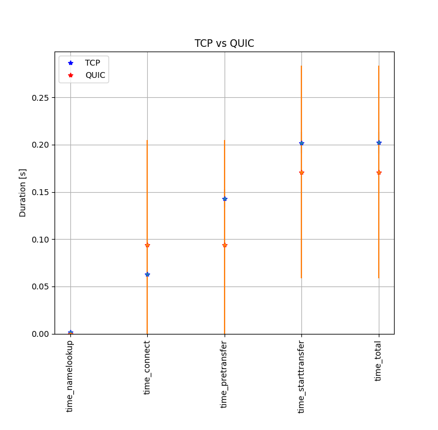

==================================================
 Comparing TCP and QUIC through a satellite link
==================================================
----------------------------------------
by Samy Bettaieb and Jonathan de Salle
----------------------------------------

1) Introduction
====================

The objective of this project is to compare the performance of TCP [#]_ and one QUIC [#]_ implementation with real servers on the Internet through a satellite link. 
The measurements should be scripted and automatically analyzed to be easily performed and reproduced.

We decided to restrict ourselves to measuring the performance of both protocols in the case of a download from the satellite link, and will not measure the performances on the upload.  

You can find the different files created for the project at the link https://github.com/jdesalle/linfo2142_project . 

2) Tools
==========

To perform the measurements, we use several tools, which will be described in this section .

We have chosen to use cloudflare's implementation of QUIC: *Quiche* [#]_  . We opted for that implementation, since it is compatible with a version of  *cURL* [#]_, which we use to perform our measurements.

To have a better control over our measurements, we implemented a web server using *Nginx 1.16*. The choice of the specific 1.16 version is because a patch for this version exists to use it with Quiche, which is the QUIC implementation we are using through this project. While Nginx has its own implementation of QUIC, we chose to keep a same implementation for the whole project. 

We use *Wireshark* [#]_ and especially its CLI interface *tshark* to capture packets and analyze their different characteristics. We will also use *QUIClog* [#]_ to analyze these packets.

Characteristics of the computer we used as our client for the tests :
    * Operating System: Ubuntu 20.04.3 LTS
    * Kernel: Linux 5.11.0-41-generic
    * Architecture: x86-64

3) Methodology
===============
We used a computer connected through a satellite link (starlink) to our web server to perform our measurement. During each measurement process, Wireshark will be monitoring the traffic to allow us to observe the negotiation of the bandwidth and other interesting information about the protocol directly.

During each measurement, we will check the time needed for different things: 

* time for the namelookup (while it is indepeddant of the protocol, it is still part of the total time)
* time to connect
* time to start  the transfer
* total time

We didn't mesure the app_connect time since there seem to be an ongoing issue in curl with it on http3 [#]_

We decided to study only the downloads, since it seem more relevant than uploads in the usercases of the user of a satellite connection.

We repeated each measurement 100 times. We will download a simple blank web page, which allowed us to check the time for a simple exchange between the sattelite and our server. 

We then tried to download files with a size ranging from 1 MB to 500 MB, to see how the size of a the downloaded file through the satellite link impacts the performance of the said connection, but we ran into some issues ( `5) Issues`_).

4) Configuration of the server
==============================
The first step of our configuration is to add your server in the /etc/host file if you do not have a DNS name attribued to your server. We had a DNS name for our server: linfo2142-grp2.info.ucl.ac.be. For other names, you may have to adpat our scripts. In our case, the IP of our server is 130.104.229.21, the command to do set a host name may look like  *$ sudo echo "130.104.229.21    linfo2142" >> /etc/hosts*

The next step is to proceed to the installation of our version of nginx. The basic explanation for building a nginx 1.16 server with Quiche can be found online [#]_. You may have to install some dependencies using your preferred package manager. 

After building nginx, you will have to add it to your path variable. There are multiple ways to do this, we chose to add it in /etc/environment.
You will have to generate files for the measurement through our script [#]_ in  /var/www/files folder, so that they will be accessible by the server. This repository must be accessible by any user.

To run nginx, you will have to add our nginx.conf [#]_ file in your nginx repository. You'll also need to put the SSL key [#]_ and certificate [#]_ of our server in a folder named "certs" created in the same directory. 
When that is done, you can run the command  *$ nginx -c nginx.conf* to launch the server.

5) Issues
============

5.1) QUIClog
------------
To analyze QUIC further, we tried to look at QUIClog. Since we are using an NGINX server and cURL to download files, we thought that the most straightforward way to do it is to use pcap2qlog [#]_ .

When using pcap2qlog, the pcap is parsed and a json file is created. That json file is then parsed and a .qlog file is created.
However, we had a bug in the second phase of the process : the .json is created correctly and the packets are decrypted (using the TLS session keys) but when creating the qlog file we had and error "Error: convertPacketHeader: unknown QUIC packet type found!  : [object Object]".

After a discussion with `François Michel <https://github.com/francoismichel>`_  and `Maxime Piraux <https://github.com/mpiraux>`_, it seemed to be a bug in pcap2qlog itself .

Thanks to a patch [#]_ from François Michel, this issue was fixed and we were able to use QUIClog.

5.2) Download files over http3
------------------------------
We tried to check the influence of the size of a file on the speed and packet loss for each protocol. For this we tried to create files of different sizes (empty, 1 MB, 100 MB, 250 MB, 500 MB) to download. 
Unfortunately, curl seems to have a problem with
big files in HTTP3 [#]_, which didn't allow making the measurement using QUIC with non-empty files.

When trying to download large files (or even non-empty files), the current speed drops to 0 and it looks like the download does not terminate even after 3 hours (see Fig.1).

The size for which it starts not working is not clear, it is a random bug, sometimes it works, but most of the time it does not.

.. figure:: images/curlhttp3.png
    :figwidth: 80%
    :align: center
    
    Fig.1 cURL over HTTP3 stopping
 
It seems to be a known bug, and since the majority of issues on this topic on github are closed, we did not notice the problem early enough to change our methodology.
We will try to find another way to download files in http3 for the final deadline.

1) Results
==========

6.1) Time measurements
------------------------

    
    Fig.2 TCP vs QUIC, 100 measurements 
 
While QUIC take more time in the connect phase (QUIC hanshake take more time than TCP handshake), we can see that it seems faster on average. 

QUIC's performance is also a lot more variable than TCP speed, it seems very unstable with a high standard deviation. It may be due to the issue with downloads with cURL in HTTP3.

6.2) Congestion control algorithms
-----------------------------------
TCP and QUIC can use the same congestion control algorithms. In our case, both the server and our client machine use cubic by default for TCP, it should be the method used.
The Quiche implementation of QUIC can use both cubic or Hystart++ [#]_. In our cases, both TCP and QUIC should use the same congestion control algorithm: cubic.

6.3) Influence of file size (in TCP, see issues)
--------------------------------------------------

For TCP we could measure the influence of the file size (unlike QUIC), the speed is dropping when the file size is increasing. The drop in speed seem to follow the concave growth of a cubic function, which is consistent with the use of the cubic congestion control algorithm

.. figure:: images/TCPspeed.png
    :figwidth: 70%

    Fig.3 TCP, download with different file sizes

6.4) QUIClog : pcap2qlog and qvis 
----------------------------------

As explained before, after applying the patch of François Michel, we were able to use pcap2qlog [#]_ to analyze QUIC.

**Reminder** : We capture traffic using tshark and then convert the .pcap file to a .qlog file using pcap2qlog. More info in our README file [#]_ .

For this test, we were also lucky with cURL over HTTP3 and we were able to download a file of 1MB multiple times for tests.

After capturing the traffic from the client side and from the server side, we created the .qlog files analysed them using another tool : *qvis* [#]_ .

*qvis* is a very powerful toolsuite for QUIC and HTTP3 visualization.

By using the "Sequence" view and the "Congestion" view in *qvis*, we did not see packet losses or abnormal congestion behaviour (we only saw the increasing congestion window). It was espected since we only downloaded a file of 1MB.
In general, we think that we need a more important traffic to see more intresting results with *qvis* : packet losses, flow control, congestion control, multiplexing information ...
We would have liked to make more important downloads but due to the issues with cURL, it was not possible.

However, *qvis* helped us correct a certain information and dicover another issue with cURL over HTTP3.
In our first measurement, we also measured the "appconnect time" [#]_ using curl and we have noticed that the average was 0 for QUIC. Our first intuition was to explain it with the use of the 0-RTT [#]_ mode in QUIC, where the transport and cryptographic handshake can be sent in a single operation along with the http3 requests in the first connection and makes a 0 Round-Trip Time possible.

But *qvis* confirmed that the 0-RTT mode was not used in our case (we can see it in the "Sequence" view). 
As a result we did not find why HTTP3 has a 0 appconnect time, and after a few research it looked like it is another issue with this version of cURL [7]_ (the appconnect time is still not supported).

For more information on *qvis*, there is an interesting video of Robin Marx explaining how to use it : https://www.youtube.com/watch?v=HQ1uIClmzkU

7) Conclusions
=================
For this study, we configured a file server compatible with both QUIC and TCP, on port 443, using NGINX 1.16. We installed a development branch of cURL, allowing HTTP3 to be able to get our measurements on a client computer, connected to a Starlink connection.
Those configurations allowed us to gather some data for both protocols, which allowed us a basic comparison between them, while running through a satellite connection. 

With this project we also discovered an issue with pcap2qlog and experienced some problems with cURL. Since the cURL branch is still considered experimental, we could've expected some strange behaviour but it was still good to experience it and discover the tool.

A lesson that we learned, to check the "known bugs" or the "issues" of a new tool before using it in our project, it would have saved us a lot of time when we tried to make sense of the issues.

8) References
==================

.. [#] https://datatracker.ietf.org/doc/html/rfc793
.. [#] https://datatracker.ietf.org/doc//html/rfc9000/
.. [#] https://github.com/cloudflare/quiche 
.. [#] https://github.com/curl/curl/blob/master/docs/HTTP3.md#quiche-version
.. [#] https://www.wireshark.org/
.. [#] https://github.com/quiclog
.. [#] https://github.com/curl/curl/wiki/HTTP3#still-doesnt-work
.. [#] https://blog.cloudflare.com/experiment-with-http-3-using-nginx-and-quiche/ 
.. [#] https://github.com/jdesalle/linfo2142_project/blob/main/files/generate.sh
.. [#] https://github.com/jdesalle/linfo2142_project/blob/main/nginx.conf
.. [#] https://github.com/jdesalle/linfo2142_project/blob/main/certs/server_cert/linfo2142_serv.key
.. [#] https://github.com/jdesalle/linfo2142_project/blob/main/certs/server_cert/linfo2142_serv.crt
.. [#] https://github.com/quiclog/pcap2qlog
.. [#] https://github.com/jdesalle/linfo2142_project/blob/main/patchForPcapToQlog/fix_qlog_parsing.patch
.. [#] https://curl.se/docs/knownbugs.html#HTTP3
.. [#] https://blog.cloudflare.com/cubic-and-hystart-support-in-quiche/
.. [#] https://github.com/quiclog/pcap2qlog
.. [#] https://github.com/jdesalle/linfo2142_project
.. [#] https://qvis.quictools.info
.. [#] https://curl.se/libcurl/c/CURLINFO_APPCONNECT_TIME.html
.. [#] https://blog.cloudflare.com/even-faster-connection-establishment-with-quic-0-rtt-resumption/
